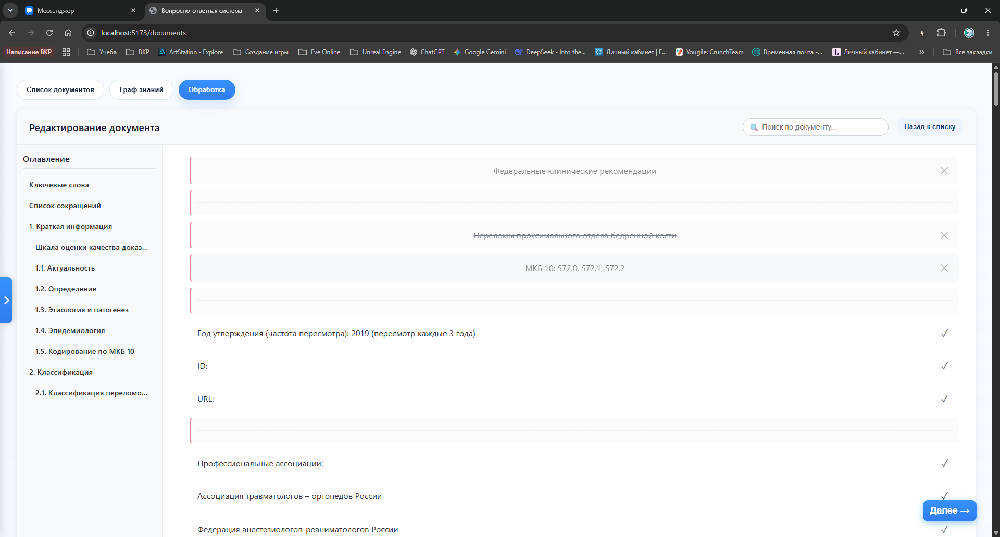
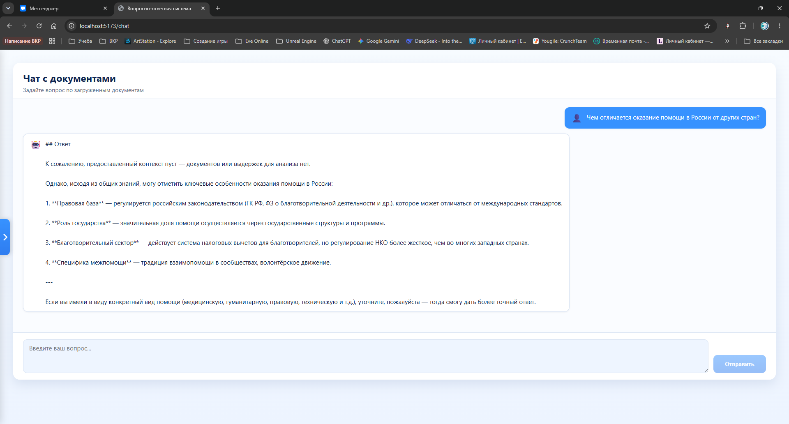
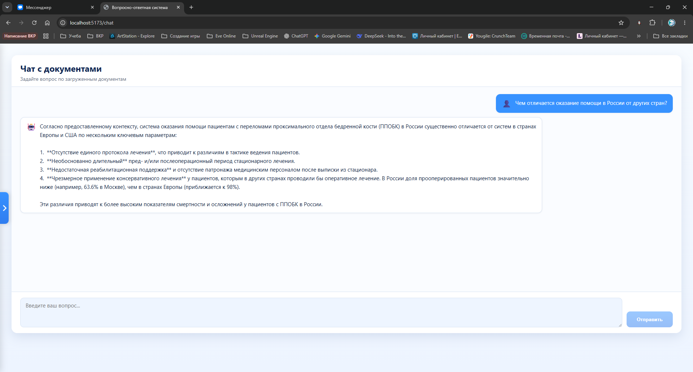
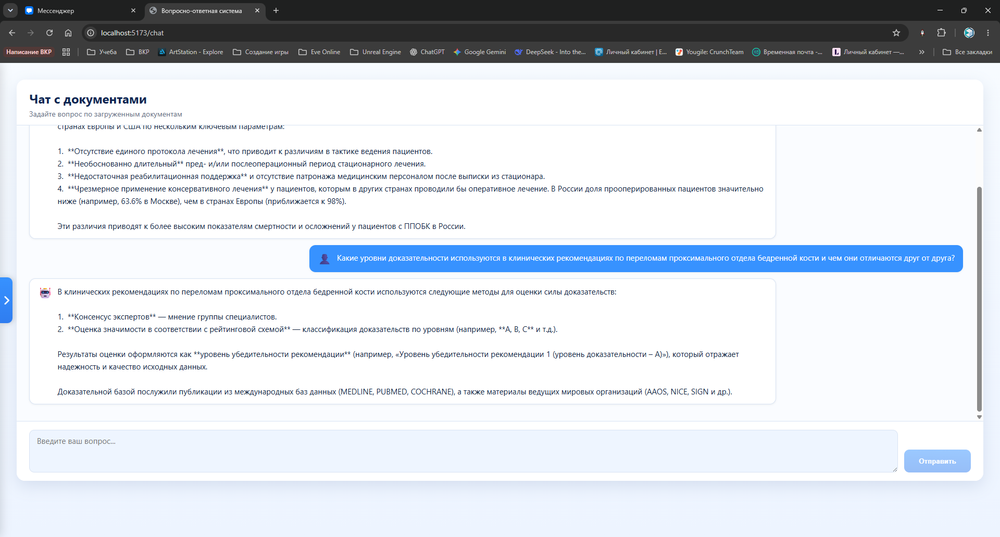

# Конструктор QA-систем

## Инструкция по установке и запуску

### 1. Требования

- Docker и Docker Compose
- Python 3.11+
- Node.js 18+

### 2. Клонирование репозитория

```commandline
git clone <repository-url>
cd <project-name>
```

### 3. Настройка переменных окружения

Создайте файл `.env` в корне проекта на основе `.env.example` и укажите необходимые значения.

```bash
# LLM
LLM_BASE_URL=https://api.xiaomimimo.com/v1
LLM_MODEL=mimo-v2-flash
LLM_API_KEY=ВАШ_КЛЮЧ

# POSTGRES
POSTGRES_USER=root
POSTGRES_PASSWORD=password
POSTGRES_DATABASE=sys-postgres-database

VITE_API_URL=http://localhost:8000
```

### 4. Запуск через Docker Compose

```bash
docker-compose up --build
```

После успешного запуска: [](http://localhost:5173)

## Скриншоты

**Окно работы с документами:**


**Загрузка и отображение документа:**


**Обработка документа:**



**Граф знаний по малому документу:**


**Запрос в чат (документы не загружены):**



**Запрос в чат (документы загружены):**



