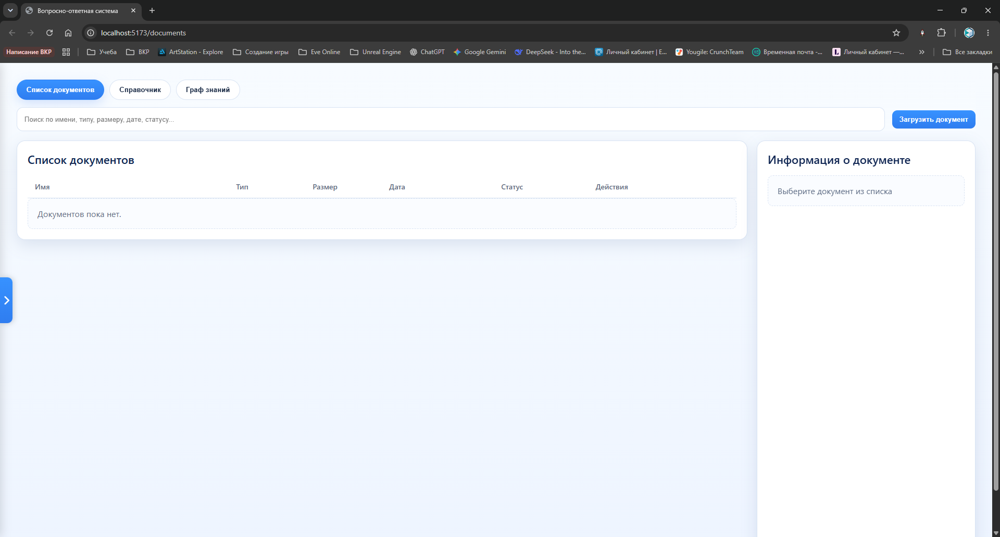
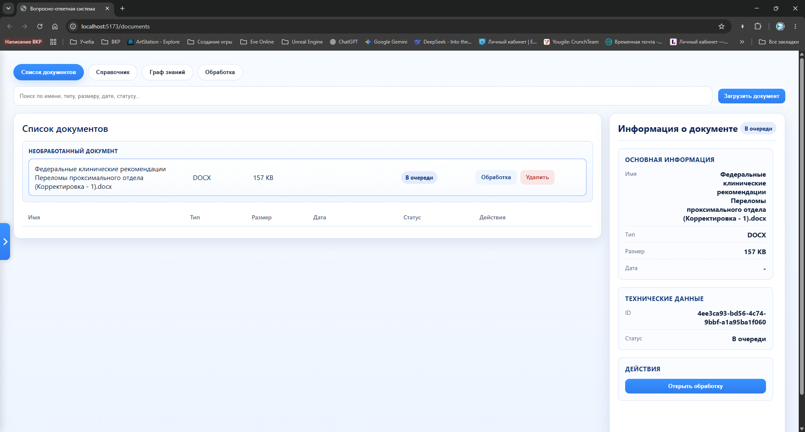
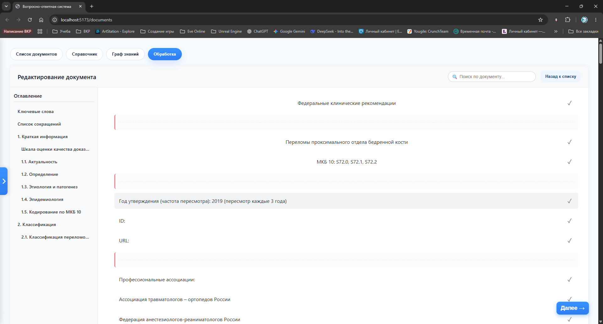
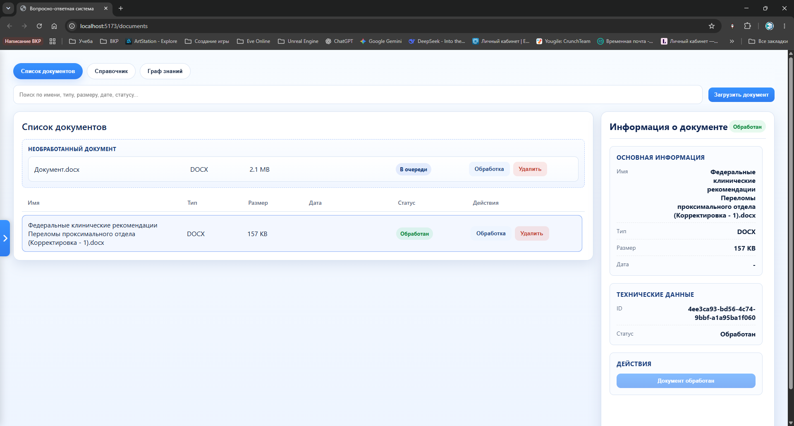

# Конструктор QA-систем

## Инструкция по установке

Клонируйте репозиторий и перейдите в папку проекта

```bash
git clone <repository-url>
cd QA-system
```

Запустите docker-compose

```bash
docker-compose up --build
```

## Скриншоты







